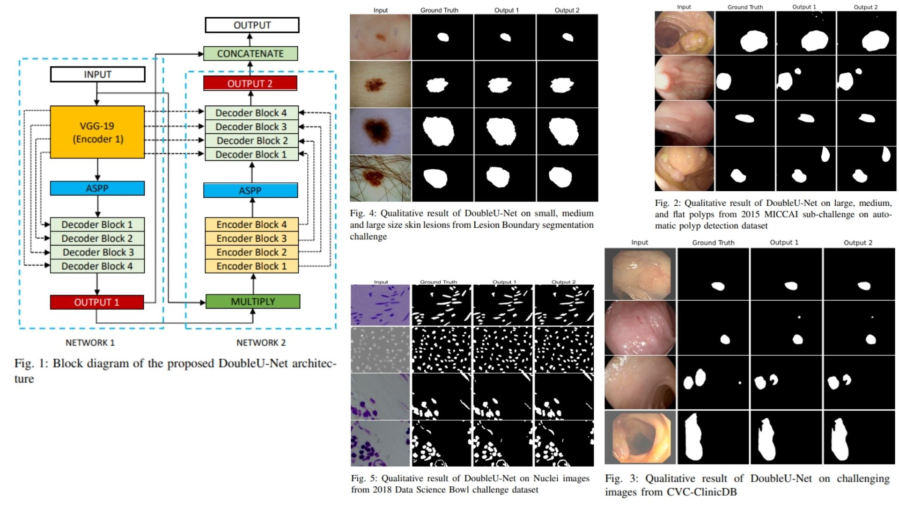

# 💊 DoubleU-Net — Dual U-Net Architecture for Medical Image Segmentation

This repository provides a **faithful Python replication** of the **DoubleU-Net framework** for 2D medical image segmentation.  
It implements the pipeline described in the original paper, including **dual U-Net stacks, ASPP modules, squeeze-and-excite blocks, and feature fusion**.

Paper reference: *[DoubleU-Net: A Deep Convolutional Neural Network for Medical Image Segmentation](https://arxiv.org/abs/2006.04868)*  

---

## Overview ✨



> The model stacks **two U-Net architectures** sequentially to enhance **semantic feature extraction** and refine segmentation masks, while leveraging **pre-trained VGG-19** for the first encoder.

Key points:

* **Encoder1** (pre-trained VGG-19) extracts hierarchical features $$F_i$$  
* **Encoder2** (scratch + Conv + SE + Pool) captures additional semantic information $$G_i$$  
* **ASPP module** captures multi-scale context $$C_i$$  
* **Decoder1** reconstructs intermediate mask $$M_1$$ using skip connections from Encoder1  
* **Fusion** multiplies $$M_1$$ with the input image $$X \odot M_1$$ to feed into Decoder2  
* **Decoder2** reconstructs final mask $$M_2$$ using skip connections from both encoders  
* **Final output** concatenates $$M_1$$ and $$M_2$$ for enhanced segmentation $$\hat{Y} = Concat(M_1, M_2)$$  

---

## Core Math 📐

**Feature refinement in Decoder1 & Decoder2:**

$$
D_i = ReLU(BN(Conv(Up(D_{i+1}) \oplus S_i)))
$$

Where $$Up()$$ is 2×2 bilinear upsampling, $$S_i$$ are skip features from encoder(s), and $$\oplus$$ denotes concatenation.

**Fusion step:**

$$
X_f = X \odot M_1
$$

**Final output mask:**

$$
\hat{Y} = Concat(M_1, M_2)
$$

**Segmentation loss** (Dice + BCE):

$$
\mathcal{L} = \mathcal{L}_{Dice} + \mathcal{L}_{BCE}
$$

**Dice coefficient**:

$$
Dice = \frac{2 \sum_i p_i g_i + \epsilon}{\sum_i p_i + \sum_i g_i + \epsilon}
$$

Where $$p_i$$ is the predicted probability, $$g_i$$ the ground truth, and $$\epsilon$$ a smoothing factor.

---

## Why DoubleU-Net Matters 🌿

* Leverages **pre-trained features** for better generalization 🧠  
* Refines segmentation with **dual U-Nets** and **fusion** ✨  
* Captures **multi-scale context** via ASPP 🌐  
* Produces **accurate masks**, especially for challenging medical images 🩺  

---

## Repository Structure 🏗️

```bash
DoubleU-Net-Replication/
├── src/
│   ├── blocks/                          
│   │   ├── conv_block.py        # Conv + BN + ReLU
│   │   ├── se_block.py          # Squeeze-and-Excite
│   │   ├── aspp.py              # ASPP module
│   │   ├── upsample.py          # UpConv
│   │   └── vgg19.py             # Encoder1 (pre-trained)
│   │
│   ├── encoder/
│   │   ├── encoder1.py          # VGG-19 encoder
│   │   └── encoder2.py          # Conv + SE + Pool encoder
│   │
│   ├── decoder/
│   │   ├── decoder1.py          # Decoder1 with skip (Encoder1)
│   │   └── decoder2.py          # Decoder2 with skip (Encoder1 + Encoder2)
│   │
│   ├── head/
│   │   └── heads.py             # Mask1 & Mask2 (1x1 Conv + Sigmoid)
│   │
│   ├── fusion/
│   │   └── multiply.py          # X ⊙ Mask1
│   │
│   ├── model/
│   │   └── double_unet.py       # Full DoubleU-Net pipeline
│   │
│   └── config.py                # Channels, device, hyperparameters
│
├── images/
│   └── figmix.jpg               
│
├── requirements.txt
└── README.md
```

---

## 🔗 Feedback

For questions or feedback, contact:  
[barkin.adiguzel@gmail.com](mailto:barkin.adiguzel@gmail.com)
